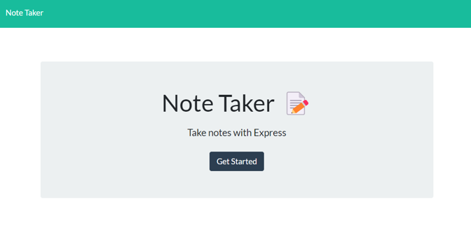
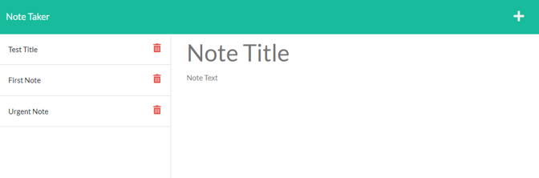

# Note Taker - Express.js  

## Table of Contents
- [Description](#description)
- [Dependencies](#Dependencies)  
- [Usage](#usage)  
- [Questions](#questions)  
  

## Description  

The Note Taker is a simple application that allows the user to record notes/tasks. The notes will be saved and then displayed in the left panel. Additionally, the user will be able to delete notes, so that only the those tasks/notes of importance will remain available for the user.  

## Dependencies  
    
The Note Taker app have two dependencies:
- express.js: Route handling
- uniqid: App used to generate id for each note

## Usage  

ADD NEW NOTE  

Click on the '+' button, the app will present cleared fields so you can enter the information. Note Title and Note Text are needed for a note to be saved. Once both fields have been entered, a save icon will appear at the top right of the screen. Click on the save button to create the note.

Once the noted is created, the title will be showed in the left side panel along with other notes previously saved.

READ SAVED NOTE:  

Click on a Note Title on the left panel and its content will be showed in the main panel.

  

## Questions
Please refer to my GitHub profile for more information: https://github.com/Lalo79  
If you have questions, you can reach me via e-mail: lalo@mail.com   
